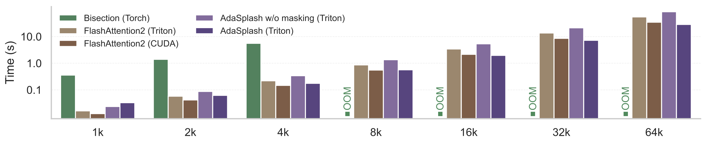

# AdaSplash

[](https://pypi.org/project/adasplash/)
[](https://huggingface.co/sardinelab/)
[](LICENSE)

AdaSplash is a Triton implementation of adaptive sparse attention based on entmax. It exposes the original **AdaSplash** kernels and the newer **🆕 AdaSplash-2** kernels through a backwards-compatible Python API.

- **AdaSplash-1**: adaptive sparse flash attention with entmax and block masking.
- **🆕 AdaSplash-2**: faster differentiable sparse attention based on histogram initialization, hybrid threshold solving, and a v2 sparse causal attention path.

Papers:

- AdaSplash: [Adaptive Sparse Flash Attention](https://openreview.net/forum?id=OWIPDWhUcO)
- AdaSplash-2: [Faster Differentiable Sparse Attention](https://openreview.net/forum?id=7qpvff2gWI)

## Installation

Install from PyPI:

```bash
pip install adasplash
```

Or install the latest development version:

```bash
pip install git+https://github.com/deep-spin/adasplash.git
```

AdaSplash requires PyTorch and Triton. CUDA is required to run the Triton kernels, but package imports are lazy, so `import adasplash` works without an active CUDA driver.

## What Is New In 🆕 AdaSplash-2?

AdaSplash-2 keeps the same sparse-entmax motivation as AdaSplash-1, but improves the core threshold and attention path:

- **Histogram initialization** for faster entmax threshold estimates.
- **Hybrid solver updates** that combine robust root-finding steps for the entmax threshold.
- **Sparse causal v2 attention** exposed as `adasplash_v2`.
- **Grouped-query attention support** through different query and key/value head counts.
- **Variable-length sequence support** with padded rows zeroed in the output.
- **Convenience v2 entmax APIs** for sparsemax, entmax-1.5, and generic entmax calls.

In `adasplash>=0.2.0`, bare `adasplash(q, k, v)` defaults to the AdaSplash-2 path when the call is supported. Explicit v1 entry points remain available for backwards compatibility.

## Public API

All public functions can be imported from the top-level package:

```python
from adasplash import (
    adasplash,
    adasplash_v1,
    adasplash_v2,
    adasplash_no_block_mask,
    triton_entmax,
    triton_entmax_v1,
    triton_entmax_v2,
    triton_sparsemax,
    triton_entmax15,
    entmax_attention,
)
```

| Function | Purpose |
| --- | --- |
| `adasplash` | Compatibility dispatcher. Uses v2 for supported causal `alpha=1.5` calls and falls back to v1 for v1-only behavior. |
| `adasplash_v2` | Direct AdaSplash-2 causal sparse attention. |
| `adasplash_v1` | Direct original AdaSplash block-mask implementation. |
| `adasplash_no_block_mask` | Original v1 no-block-mask implementation. |
| `triton_entmax` | Default v2 entmax API. |
| `triton_entmax_v2` | Direct v2 entmax with histogram and hybrid solver support. |
| `triton_entmax_v1` | Original entmax implementation. |
| `triton_sparsemax` | Convenience v2 sparsemax call, equivalent to entmax with `alpha=2.0`. |
| `triton_entmax15` | Convenience v2 entmax-1.5 call. |
| `entmax_attention` | Dense attention utility using v2 `triton_entmax`. |

## Sparse Attention Examples

### Default Dispatcher

```python
import torch
from adasplash import adasplash

q = torch.randn(1, 8, 128, 64, device="cuda")
k = torch.randn(1, 8, 128, 64, device="cuda")
v = torch.randn(1, 8, 128, 64, device="cuda")

out = adasplash(q, k, v)
```

For supported causal `alpha=1.5` calls, `adasplash` routes to AdaSplash-2. Calls that request v1-only behavior, such as `alpha != 1.5` or `is_causal=False`, route to the v1 implementation.

```python
# Uses AdaSplash-2.
out_v2_default = adasplash(q, k, v, is_causal=True)

# Uses the v1 compatibility path.
out_v1_alpha = adasplash(q, k, v, alpha=1.333)
out_v1_noncausal = adasplash(q, k, v, is_causal=False)
```

### Explicit V1 And V2 Calls

```python
from adasplash import adasplash_v1, adasplash_v2

out_v1 = adasplash_v1(q, k, v, alpha=1.5, is_causal=True, niter=10)
out_v2 = adasplash_v2(q, k, v, niter=1)
```

### Variable-Length Sequences

```python
from adasplash import adasplash

varlen = torch.tensor([96], device="cuda", dtype=torch.int32)
out = adasplash(q, k, v, varlen=varlen)
```

Rows beyond each valid sequence length are zeroed in the output.

### Grouped-Query Attention With AdaSplash-2

```python
from adasplash import adasplash_v2

q = torch.randn(1, 8, 256, 64, device="cuda")
k = torch.randn(1, 2, 256, 64, device="cuda")
v = torch.randn(1, 2, 256, 64, device="cuda")

out = adasplash_v2(q, k, v)
```

`adasplash_v2` supports grouped-query attention when the number of query heads is divisible by the number of key/value heads.

## Triton Entmax Examples

```python
import torch
from adasplash import triton_entmax, triton_entmax_v1, triton_sparsemax, triton_entmax15

x = torch.randn(128, 256, device="cuda")

y = triton_entmax(x, alpha=1.5, n_iter=2, use_histogram=True)
y_v1 = triton_entmax_v1(x, alpha=1.5, n_iter=10, fast_math=True)
y_sparsemax = triton_sparsemax(x)
y_entmax15 = triton_entmax15(x)
```

`triton_entmax` points to the v2 implementation in `0.2.0`. Strict v1 users should call `triton_entmax_v1`.

For generic alpha values other than `1.5` and `2.0`, v2 disables histogram initialization internally and uses more refinement iterations for correctness.

## Dense Entmax Attention Utility

```python
from adasplash import entmax_attention

out = entmax_attention(
    q,
    k,
    v,
    alpha=1.5,
    is_causal=True,
    varlen=None,
    padding="right",
)
```

`entmax_attention` is a dense utility built on top of v2 `triton_entmax`. It supports causal masking, non-causal masking, variable lengths, left/right padding, ALiBi slopes, and gradients through `q`, `k`, and `v`.

## Backwards Compatibility

AdaSplash `0.2.0` changes the default direction of the top-level APIs:

- `adasplash(q, k, v)` uses AdaSplash-2 when the call is supported.
- `triton_entmax(x)` uses the v2 entmax implementation.
- Explicit v1 names are preserved: `adasplash_v1`, `adasplash_no_block_mask`, and `triton_entmax_v1`.

If you need strict AdaSplash-1 behavior, use the `_v1` names directly.

## Testing

Install development dependencies:

```bash
pip install -r requirements-dev.txt
```

No-GPU import and public API checks:

```bash
TRITON_INTERPRET=1 pytest -q
```

Fast CUDA suite:

```bash
pytest -q -m "not slow and not stress"
```

Slow CUDA correctness suite:

```bash
pytest -q -m "slow"
```

Stress tests run dense reference checks for long contexts and may skip cases when the current GPU does not have enough memory or shared memory:

```bash
pytest -q -m "stress"
```

## Benchmarks And Models

### Efficiency



### Sparse Models

Sparse models and related artifacts are hosted under the [SARDINE Lab Hugging Face organization](https://huggingface.co/sardinelab/).

For single-vector retrieval experiments, see the [Sparse ModernBERT repository](https://github.com/deep-spin/SparseModernBERT).

## Citation

If you use AdaSplash in your research, please cite the relevant paper.

AdaSplash-1:

```bibtex
@inproceedings{
goncalves2025adasplash,
title={AdaSplash: Adaptive Sparse Flash Attention},
author={Nuno Gon{\c{c}}alves and Marcos V Treviso and Andre Martins},
booktitle={Forty-second International Conference on Machine Learning},
year={2025},
url={https://openreview.net/forum?id=OWIPDWhUcO}
}
```

AdaSplash-2:

```bibtex
@inproceedings{
goncalves2026adasplash,
title={AdaSplash-2: Faster Differentiable Sparse Attention},
author={Nuno Gon{\c{c}}alves and Hugo Pitorro and Vlad Niculae and Edoardo Ponti and Lei Li and Andre Martins and Marcos V Treviso},
booktitle={Forty-third International Conference on Machine Learning},
year={2026},
url={https://openreview.net/forum?id=7qpvff2gWI}
}
```

## License

AdaSplash is licensed under the BSD-3-Clause License. See the [LICENSE](LICENSE) file for details.

## Acknowledgements

> We would like to the SARDINE lab team for the helpful discussions. This work was supported by the project DECOLLAGE (ERC-2022-CoG 101088763), by the Portuguese Recovery and Resilience Plan through project C64500888200000055 (Center for Responsible AI), and by FCT/MECI through national funds and when applicable co-funded EU funds under UID/50008: Instituto de Telecomunicações. Vlad Niculae is supported by the Dutch Research Council (NWO) via VI.Veni.212.228. Edoardo M. Ponti is supported by the ERC Starting Grant AToM-FM (101222956).
